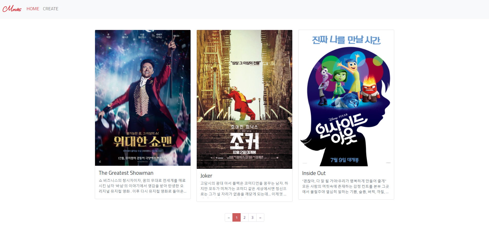
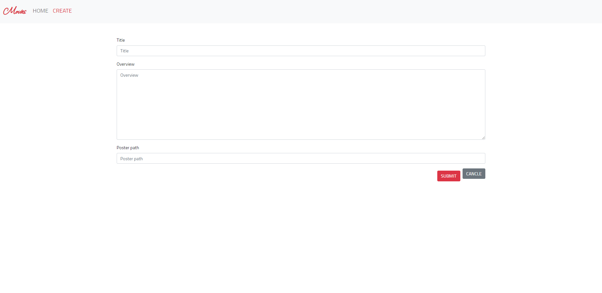
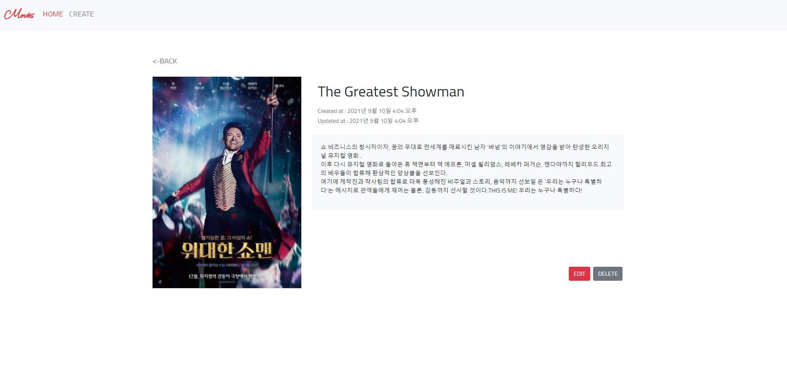
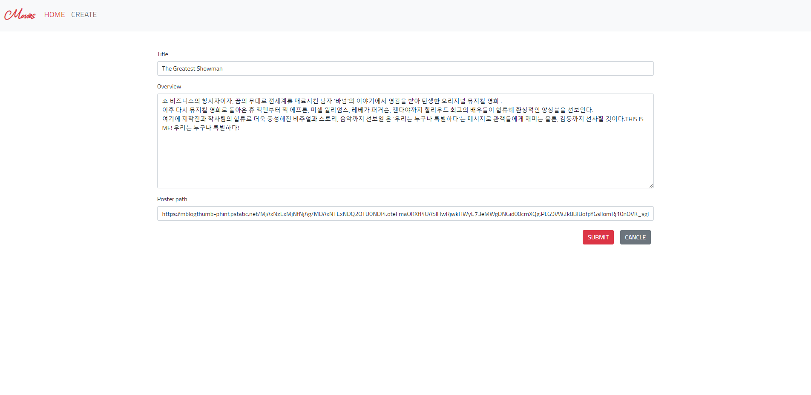

# pjt05 README


## 1. Description

 본 프로젝트는 영화 커뮤니티 서비스 개발을 위한 프론트 화면 구현하는 목적을 갖습니다.


## 2. Environment

- Windows OS 활용
- Bootstrap v5
- Google Chrome Browser
- Python 3.9.6 활용


## 3. Prerequisite

- 영화 기본 이미지


## 4. Explanation

💙**기본 settings**

### A. movies/models.py

- Fields : title / overview / poster_path / created_at / updated_at 으로 구성


### B. movies/forms.py

- ModelForm 써서 models.py 와 연결


### C. movies/admin.py

- Movie 클래스 등록


### D. pjt05/urls.py

- movies.urls로 연결

### E. base.html

- navbar : 이동 구역에 따른 컬러 변경 구현, 

---

**💙요구 사항 구현**

### 1. Index (전체 목록 조회)



- **문제 목적**

  - 핵심 : 전체 영화 목록을 page에 따라 조회
  - 세부 : Pagination, Grid Card, text over-flow 처리 구현, @require_safe 활용하여 오류 처리

- **주요 어려움**

  1. paginator 구현 및 스타일링

     - 어려웠던 점

       - bootstrap install부터 앱등록, view 처리, html에서 구현 등 일련의 복잡한 절차들이 있어서 어려웠음
       - 이미 적용된 스타일이 있어서 스타일 바꾸기가 어려웠음

     - 해결 방법 : 하나하나 기존에 배웠던 것과 구글링을 통해 찾아가며 구현 (스택 오버 플로우 활용)

       ```python
       @require_safe
       def index(request):
           movies = Movie.objects.order_by('-pk')
           paginator = Paginator(movies, 3)
           page_number = request.GET.get('page')
           page_obj = paginator.get_page(page_number)
           context = {
               'movies': movies,
               'page_obj': page_obj,
           }
           return render(request, 'movies/index.html', context)
       ```

       ```html
       
       
         <style>
             .pagination > li > a
             {
                 background-color: white;
                 color: #5A4181;
             }
             .pagination > li > a:focus,
             .pagination > li > a:hover,
             .pagination > li > span:focus,
             .pagination > li > span:hover
             {
                 color: #5a5a5a;
                 background-color: #eee;
                 border-color: #ddd;
             }
             .pagination > .active > a
             {
                 color: white;
                 background-color: #CD5C5C !Important;
                 border: solid 1px #CD5C5C !Important;
             }
             .pagination > .active > a:hover
             {
                 background-color: #CD5C5C !Important;
                 border: solid 1px #CD5C5C;
             }
         </style>
       
       
       <div class="row row-cols-1 row-cols-md-3 g-4">
         
           <div class="col">
             <div class="card">
               <a href="">
                 
               </a>
               <a href="" class="text-decoration-none text-dark">
                 <div class="card-body" height="100px">
                   <h4 class="card-title">{{ movie.title }}</h4>
                   <p class="card-text text-secondary">{{ movie.overview }}</p>
                 </div>
               </a>
             </div>
           </div>
         
       </div>
       
       <div class="d-flex justify-content-center m-5">
          
       </div>
       ```

### 2. Create (새로운 영화 생성)



- **문제 목적**

  - 핵심 : 새로운 영화를 form 형식에 맞춰서 생성
  - 세부 : ModelForm, bootstrap form 활용, @require_http_methods(['GET', 'POST']) 활용하여 오류 처리

- **주요 어려움**

  1. navbar에 create로 가면 active로 변경

     - 어려웠던 점 : 어떻게 create가 create인지 알려줄 수 있을지 고민

     - 해결 방법 : create일때 navbar 변수를 만들어 아닌 경우와 if문을 통해 구분

       ```python
       @require_http_methods(['GET', 'POST'])
       def create(request):
           if request.method == 'POST':
               form = MovieForm(request.POST)
               if form.is_valid():
                   movie = form.save()
                   return redirect('movies:detail', movie.pk)
           else:
               form = MovieForm()
               navbar = 'create'
           context = {
               'form': form,
               'navbar': navbar,
           }
           return render(request, 'movies/create.html', context)
       ```

       ```html
       
           <li class="nav-item">
               <a class="nav-link" aria-current="page" href=""><h5>HOME</h5></a>
           </li>
           <li class="nav-item">
               <a class="nav-link active text-danger" href=""><h5>CREATE</h5></a>
           </li>
           
           <li class="nav-item">
               <a class="nav-link active text-danger" aria-current="page" href=""><h5>HOME</h5></a>
           </li>
           <li class="nav-item">
               <a class="nav-link" href=""><h5>CREATE</h5></a>
           </li>
       
       ```

  2. 제출과 취소 버튼 한 줄에 구현

     - 어려웠던 점 : 제출은 form 안에 취소는 밖에 있어서 어떻게 구현해야될 지 고민됐음

     - 해결 방법 : form 안에 둘 다 넣고 d-flex로 묶어주면 가능

       ```html
       
       
       
       
           <form action="" method="POST">
             
             
             <div class="d-flex justify-content-end">
               <button class="btn btn-danger m-2">SUBMIT</button>
               <a href="">
                 <button class="btn btn-secondary">CANCLE</button>
               </a>
             </div>
           </form>
       
       ```

### 3. Detail (영화 상세 조회)



- **문제 목적**

  - 핵심 : 영화 상세 내용 조회 페이지, 수정과 삭제 버튼 구현
  - 세부 : POST 처리, url 처리, d-flex 구현, @require_safe 활용하여 오류 처리

### 4. Update (영화 수정) 



- **문제 목적**
  - 핵심 : 기존 영화를 form 형식에 맞춰서 수정
  - 세부 : ModelForm, bootstrap form 활용, instance변수를 통해 기존 데이터 form에 채워넣기, @require_http_methods(['GET', 'POST']) 활용하여 오류 처리


### 5. Delete (영화 삭제)

- **문제 목적**

  - 핵심 : 영화 삭제 구현
  - 세부 : POST 처리, @require_POST 활용하여 오류 처리


## 5. After Project

### 😊 What I Learned

- Pagination 구현
- view decorator, get_object_or_404를 통한 오류 처리
- model form 활용 방법
- navbar page별 active 구현

🍇 **Pair Programming**

- 서로 몰랐던 점을 보완할 수 있었음
- 새로운 것을 시도해볼 때 조금 더 과감하게 시도할 용기가 생김
- 디버깅할 때 두 명이라 더 빠르게 찾을 수 있었음

### 😂 What to Learn

- 사용법만 익히는 것이 아니라 어떤 원리로 어떻게 적용되는지 파악하는 법 배우기
- 새롭게 배운 것 적용해 보기 (API, error 페이지 custom, animator, favicon, ImageField)